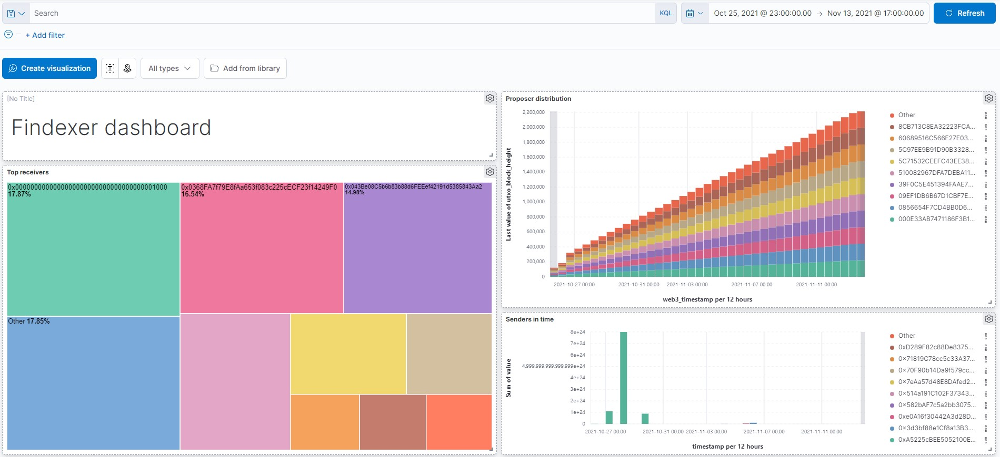

# Findexer

_Submission for https://gitcoin.co/issue/findoranetwork/bounties/2/100026989_

Findexer, as the name suggests, is mainly a Findora indexer, however it makes 
searching, analyzing, and visualizing possible as well. It's an attempt to make 
Findora's blockchain data more accessible and easier to search and explore.



When you fire up Findexer for the first time, it automatically starts indexing.
Findora operates on two intertwined blockchains. First one is a privacy-focused
UTXO blockchain, and the second is an EVM blockchain. Findexer starts from the
first block at `height=1` and goes up the ledger on both blockchains.
Gradually, **four** different indices are made for each network:

* `<network>_utxo`: UTXO blockchain information all indexed (nested)
* `<network>_web3`: EVM blockchain information all indexed (nested)
* `<network>_tx`: EVM transactions as a separate flattened index
* `<network>_flat`: UTXO+EVM blockchains combined and flattened

Before starting to use Findexer, it's important to learn about these indices
and fully understand the use cases and differences of each one. Please visit
the [wiki](https://github.com/nickyharpor/Findexer/wiki) once and save
yourself hours of frustration in the future.

## Quickstart

Getting Findexer to work is pretty easy. There is an automated script that
does **everything** for you. It's been tested on Ubuntu 20.04, but should work
on most Debian-based operating systems.

Simply, clone this repository and go inside it:

```
git clone https://github.com/nickyharpor/Findexer.git && cd Findexer
```

Optionally, you may do some
[configuration](https://github.com/nickyharpor/Findexer/wiki/Configuration).
Finally, execute
[run.sh](https://github.com/nickyharpor/Findexer/blob/master/run.sh)
as a privileged user:

```
source run.sh
```

That's it! Wait for the script to finish. In a nutshell, the script installs
docker (if it doesn't exist), sets up environment, builds a docker image, and
runs all necessary docker containers.

If you're using another distro or OS, all you need is docker installed. You
may check [run.sh](https://github.com/nickyharpor/Findexer/blob/master/run.sh)
and execute the corresponding commands for your OS manually.

## Features

Findexer comes with several features to accelerate integration of other
services with Findora. Here is a list of the main features:

* ### SQL CLI ([Examples](https://github.com/nickyharpor/Findexer/wiki/SQL-Examples))

* ### REST API ([Endpoints](https://github.com/nickyharpor/Findexer/wiki/REST-API))

* ### Web Dashboard ([Preview](https://github.com/nickyharpor/Findexer/wiki/Dashboard))
